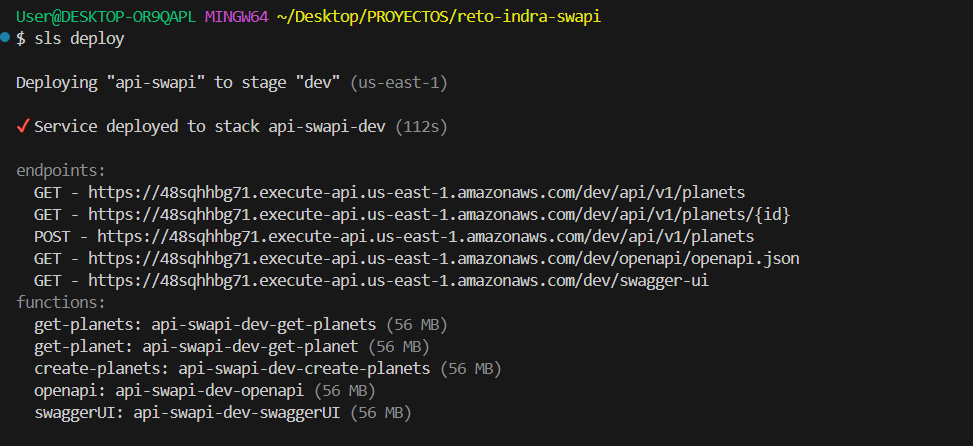

# PASOS PARA EJECUTAR EL PROYECTO CONSUMIR API DE SWAPI

# Instalar las dependencias
npm install

# Generar la documentacion de Openapi
serverless openapi generate --output ./openapi/openapi.json

# Correr mis Test
npm test

# Deploy de mis Lambda
# serverless offline start --reloadHandler  (Local)
# GET  | http://localhost:3000/api/v1/planets 
# GET  | http://localhost:3000/api/v1/planets/{id}  
# POST | http://localhost:3000/api/v1/planets  (Inserta la data consumida de la api de Swapi)
# GET  | http://localhost:3000/api/swagger-ui   (Documentacion si queremos visualizarla en local cambiamos esta url https://levxjpccd0.execute-api.us-east-1.amazonaws.com/api/openapi/openapi.json por esta http://localhost:3000/api/openapi/openapi.json 
# en el archivo /openapi(openapi.json))  

# sls deploy (Produccion)
# GET - https://levxjpccd0.execute-api.us-east-1.amazonaws.com/api/v1/planets
# GET - https://levxjpccd0.execute-api.us-east-1.amazonaws.com/api/v1/planets/{id}
# POST - https://levxjpccd0.execute-api.us-east-1.amazonaws.com/api/v1/planets  (Inserta la data consumida de la api de Swapi)
# GET - https://levxjpccd0.execute-api.us-east-1.amazonaws.com/api/openapi/openapi.json
# GET - https://levxjpccd0.execute-api.us-east-1.amazonaws.com/api/swagger-ui  (Documentacion)
